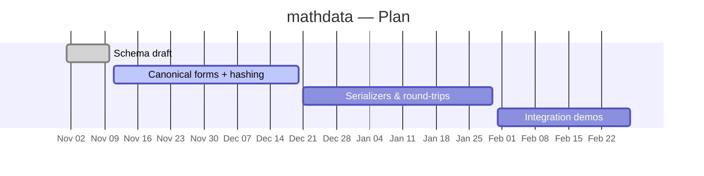

Modern science produces increasingly large volumes of data consisting of mathematical (structured) objects.
Despite this trend there is no standard way of representing mathematical data.
Each group develops in-house formats adequate for their particular application, making data sharing and reuse costly.

The mathdata project addresses several fundamental problems:

1. **Reinventing the wheel** — existing data is reproduced each time instead of reused.
2. **Babel effect** — knowledge about the same object from different sources is hard to combine.
3. **Modern tools** — the math community cannot leverage modern data storage and analytic methods.
4. **Credibility** — self-selected benchmarks reduce the credibility of algorithm comparisons.
5. **Reproducibility** — results cannot be independently reproduced if data is not shareable.

## Goals

- Develop a language (MathDataLang) for describing mathematical data
- Implement a database of mathdata objects
- Build a system for automatic benchmarking
- Create a community around MathData

## Project Parts

**Authentication** — owner, editor, user, and external roles; LDAP and cross-database authentication.

**Backend** — git-based storage for reproducibility; scalable distributed architecture.

**Frontend** — web interface for querying and submitting data.

**DataSanitizer** — validates instances against MathDataLang definitions.

## Resources

- Repo: [math-data](https://github.com/zafeirakopoulos/math-data)
- Related: [OpenMath](https://openmath.org/), [MathML](https://en.wikipedia.org/wiki/MathML), [OEIS](https://oeis.org/)

## Plan

