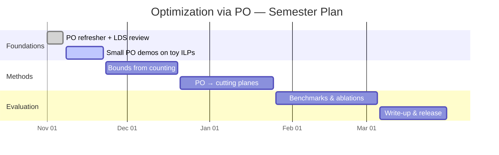

**Goal:** Bridge PO-based exact counting with optimization — solve or accelerate ILPs and structured integer programs using information extracted by Polyhedral Omega.

## Threads

1. PO → objective bounds for knapsack-like families
2. PO-informed cutting planes
3. Hybrid methods with classical solvers

## Plan

