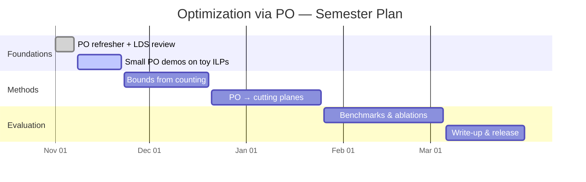

**Goal:** Bridge PO-based exact counting with optimization — solve or accelerate integer linear programs (ILPs) using information extracted by Polyhedral Omega.

Classical ILP solvers (branch-and-bound, cutting planes) treat the feasibility question as a search problem. Polyhedral Omega instead computes an _exact_ generating function that encodes the full solution set. This generating function carries global information — number of solutions, optimal value, sensitivity — that classical solvers can only obtain heuristically.

## Threads

### 1. PO → objective bounds for knapsack-like families

For a parametric family of ILPs (e.g., the knapsack problem with capacity $$c$$), PO produces a rational generating function valid across all $$c$$. Extracting the coefficient for a specific $$c$$ gives the exact count; the maximum achieving coefficient gives the optimum.

### 2. PO-informed cutting planes

The generating function can certify infeasibility or reveal the structure of the integer hull. This structure can be translated into cutting planes that tighten the LP relaxation faster than generic cuts.

### 3. Hybrid methods

Combine PO (exact, expensive) with classical solvers (approximate, fast): run PO for small subproblems to produce strong bounds, then use branch-and-bound globally.

## Background

Barvinok's algorithm (1994) counts integer points in a polytope in polynomial time when the dimension is fixed. Polyhedral Omega (Breuer & Zafeirakopoulos, 2017) extends this to parametric settings, computing a piecewise rational generating function over the parameter space.

## Plan

## References

1. A. I. Barvinok. _A Polynomial Time Algorithm for Counting Integral Points in Polyhedra When the Dimension is Fixed._
   **Mathematics of Operations Research**, 19(4):769–779, 1994.
   [DOI 10.1287/moor.19.4.769](https://doi.org/10.1287/moor.19.4.769)

2. F. Breuer and Z. Zafeirakopoulos. _Polyhedral Omega: a New Algorithm for Solving Linear Diophantine Systems._
   **Annals of Combinatorics**, 21(2):211–280, 2017.

3. S. Verdoolaege, R. Seghir, K. Beyls, V. Loechner, and M. Bruynooghe. _Counting Integer Points in Parametric Polytopes Using Barvinok's Rational Functions._
   **Algorithmica**, 48(1):37–66, 2007.
   [DOI 10.1007/s00453-006-1231-0](https://doi.org/10.1007/s00453-006-1231-0)

4. T. Ayyildiz, D. N. Demirel, I. Tapan, and Z. Zafeirakopoulos. _A Julia Package for Polyhedral Omega and Applications._
   MACIS 2024.
