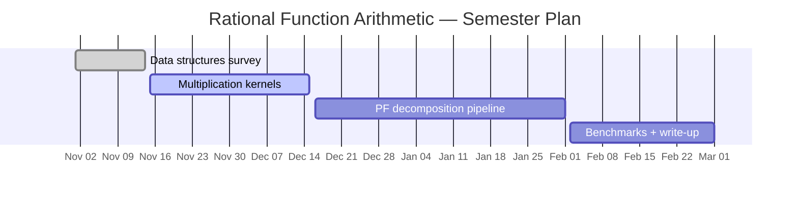

This is the broader research program around efficient arithmetic for rational functions, motivated by the need to compute with generating functions produced by Polyhedral Omega, Barvinok's algorithm, and related tools.

**Why rational functions?** Most exact counting algorithms (Barvinok, Ehrhart–Macdonald, omega elimination) produce their output as rational functions $$P/Q \in \mathbb{Q}(x_1,\ldots,x_n)$$. Subsequent computations — summing contributions from different cones, extracting coefficients by partial fractions, applying Möbius inversion — all reduce to rational function arithmetic. Bottlenecks in these steps limit the size of problems we can handle exactly.

## Themes

**Sparse multivariate representations.** The rational functions arising in combinatorics are typically sparse: their numerators and denominators have far fewer terms than the dense worst case. Sparse data structures (hashtable-based polynomial rings, sorted term arrays) reduce both memory and arithmetic cost.

**Partial fraction strategies.** Extracting a specific coefficient $$[x^k] P(x)/Q(x)$$ requires partial fraction decomposition. In the univariate case this is classical; in the multivariate case one must choose an elimination order, and the result depends on the geometry of the denominator's zero set.

**Cache-friendly multiplication & reduction.** Multiplying two sparse polynomials is essentially a merge of term products; sorting strategies and SIMD-friendly layouts can give significant speedups. GCD-based reduction is the dominant cost and benefits from modular techniques.

## Plan

## References

1. A. I. Barvinok. _A Polynomial Time Algorithm for Counting Integral Points in Polyhedra When the Dimension is Fixed._
   **Mathematics of Operations Research**, 19(4):769–779, 1994.
   [DOI 10.1287/moor.19.4.769](https://doi.org/10.1287/moor.19.4.769)

2. M. Köppe and S. Verdoolaege. _Computing Parametric Rational Generating Functions with a Primal Barvinok Algorithm._
   **Electronic Journal of Combinatorics**, 15(1), 2008.
   [combinatorics.org](http://www.combinatorics.org/Volume_15/Abstracts/v15i1r16.html)

3. F. Breuer and Z. Zafeirakopoulos. _Polyhedral Omega: a New Algorithm for Solving Linear Diophantine Systems._
   **Annals of Combinatorics**, 21(2):211–280, 2017.
