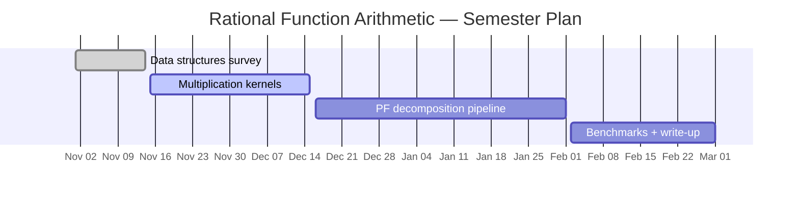

**Themes**

- Sparse multivariate representations
- Partial fraction strategies
- Cache-friendly multiplication & reduction

## Plan

```mermaid
gantt
  title Rational Function Arithmetic — Semester Plan
  dateFormat  YYYY-MM-DD
  axisFormat  %b %d
  Data structures survey         :done,  r1, 2025-11-01, 2025-11-14
  Multiplication kernels         :active,r2, 2025-11-15, 2025-12-15
  PF decomposition pipeline      :      r3, 2025-12-16, 2026-02-01
  Benchmarks + write-up          :      r4, 2026-02-02, 2026-03-01
```
