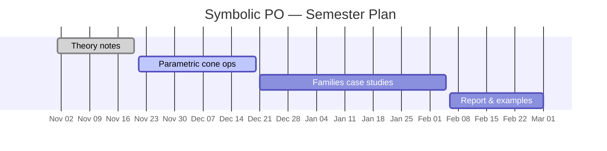

**Focus**

- Parametric feasibility and optimality regions
- Symbolic cones & transformations
- Sensitivity and bifurcation analysis

The goal is to extend Polyhedral Omega to handle families of problems where some coefficients are symbolic (parametric), enabling family-wise solutions and sensitivity analysis.

## Plan

