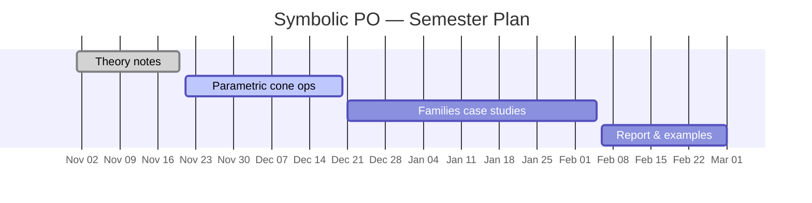

**Focus:** Extend Polyhedral Omega to handle families of problems where some coefficients are symbolic (parametric), enabling family-wise solutions and sensitivity analysis.

## Motivation

Standard Polyhedral Omega takes a linear Diophantine system $$A\mathbf{x} = \mathbf{b},\; \mathbf{x}\geq 0$$ with integer $$A, \mathbf{b}$$ and returns a rational generating function for all integer solutions. In the **symbolic** variant, some entries of $$\mathbf{b}$$ (or $$A$$) are treated as formal parameters $$\mathbf{p}$$. The output is a _piecewise_ rational function: for each chamber in parameter space, a different rational expression counts the solutions.

This yields:

- **Parametric feasibility regions** — the set of $$\mathbf{p}$$ for which solutions exist.
- **Optimal value functions** — the optimal objective as a closed-form function of $$\mathbf{p}$$.
- **Sensitivity analysis** — how the optimum changes as $$\mathbf{p}$$ varies continuously.

## Core challenges

1. **Symbolic cone operations** — the omega elimination step must track symbolic constraints, leading to parameterized polyhedral cones.
2. **Chamber decomposition** — subdivide parameter space into chambers such that the generating function is a fixed rational function within each chamber.
3. **Computational complexity** — the number of chambers may be exponential; efficient data structures and algorithms are needed.

## Plan

## References

1. A. I. Barvinok. _A Polynomial Time Algorithm for Counting Integral Points in Polyhedra When the Dimension is Fixed._
   **Mathematics of Operations Research**, 19(4):769–779, 1994.
   [DOI 10.1287/moor.19.4.769](https://doi.org/10.1287/moor.19.4.769)

2. F. Breuer and Z. Zafeirakopoulos. _Polyhedral Omega: a New Algorithm for Solving Linear Diophantine Systems._
   **Annals of Combinatorics**, 21(2):211–280, 2017.

3. S. Verdoolaege, R. Seghir, K. Beyls, V. Loechner, and M. Bruynooghe. _Counting Integer Points in Parametric Polytopes Using Barvinok's Rational Functions._
   **Algorithmica**, 48(1):37–66, 2007.
   [DOI 10.1007/s00453-006-1231-0](https://doi.org/10.1007/s00453-006-1231-0)

4. M. Köppe and S. Verdoolaege. _Computing Parametric Rational Generating Functions with a Primal Barvinok Algorithm._
   **Electronic Journal of Combinatorics**, 15(1), 2008.
   [combinatorics.org](http://www.combinatorics.org/Volume_15/Abstracts/v15i1r16.html)
